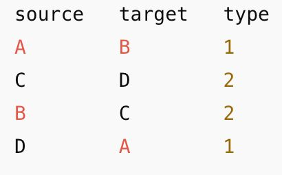
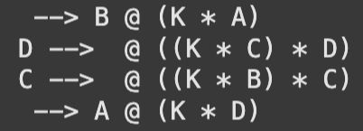

# Rebop_Parser
### Tool to convert a GRN .topo file to a Rebop reaction (formalism predefined)

## What is rebop?
'rebop' is a fast stochastic simulator for well-mixed chemical reaction networks.
[Click here to visit rebop](https://github.com/Armavica/rebop/tree/main)

## Formalism 
Example Topo file structure for a 4-node GRN.

Here, under 'Type', '1' represents Activation, '2' represents Inhibition.
In our formalism for interpreting a GRN as a rebop reaction to be simulated, the following assumptions have been made:
    1) Activation - Target node is generated at rate: r = k * {Source}, where k is a adjustable rate parameter.
    2) Inhibition - Target node is consumed at rate: r = k * {Source} * {Target}, the inclusion of Target node concentration is to avoid negative populations.
    

The formalism is still under review, and will be updated.
    
    
